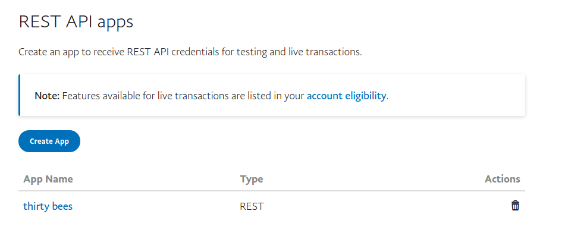
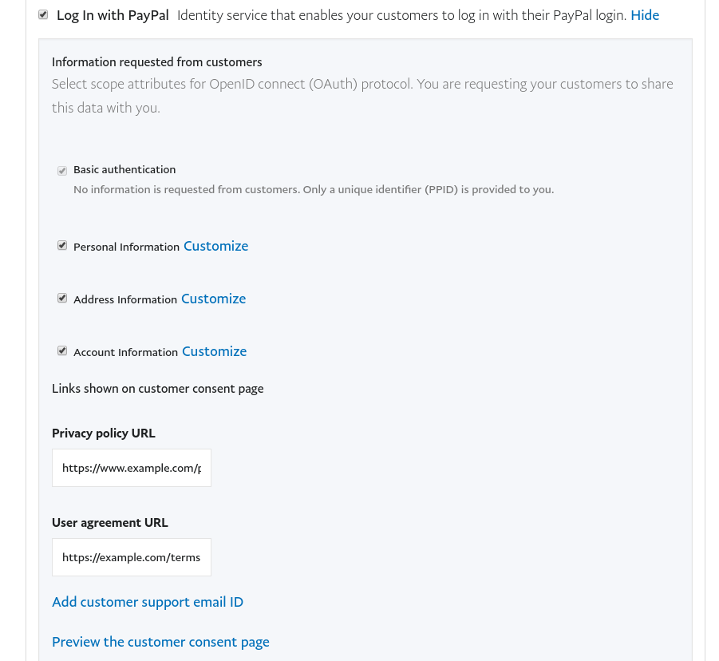
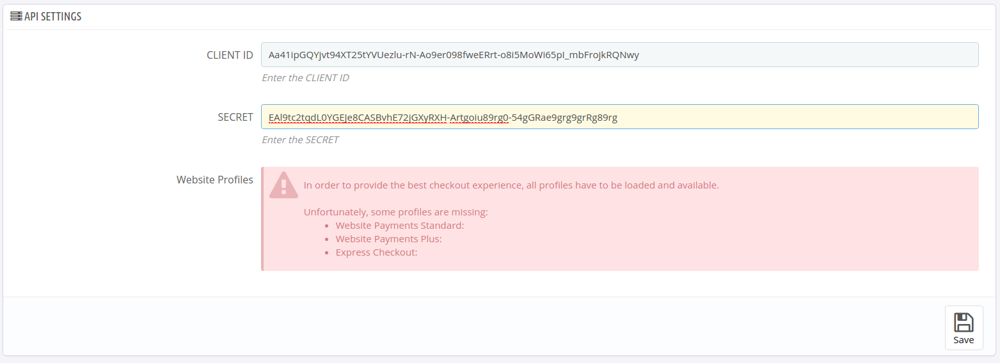

#Paypal Module by thirty bees

## Setting up the PayPal Module

Installing the module involves getting your PayPal API credentials into the module as well.
Besides an explanation on how to install this module, this guide also describes how to retrieve the necessary PayPal REST API credentials in order to connect the module with your PayPal account and to start receiving payments.
PayPal provides a sandbox environment which allows you to test the module first. We strongly recommend you to follow this procedure and that is why this 
guide will first describe how to connect with the sandbox environment before getting into detail on how to go live with the module.

### Installing the PayPal module  

In admin, navigate to Modules and Services, List of Modules, Payments and Gateways.

- Search for **paypal** from the module list
- Click **Configure**  

### Developer Page
Open a new browser window and go to this page: [https://developer.paypal.com/developer/applications/](https://developer.paypal.com/developer/applications/) and log in.

- Log in with your normal PayPal credentials which consists of your email and password.
- Click "dashboard" at the top right of the page.
- Scroll down until you find: `REST API apps`

#### Registering an app to the REST API (sandbox)

- Click the button that says `Create App`.  

- **Create New App:**  
Enter an App name that is related to your website and business.

- In this same section, under the App Name, make sure the correct email is listed under "Sandbox developer account".
- Click the `Create App` button.  
- Scroll down to "SANDBOX APP SETTINGS" and choose the following feature options:  
  - `Accept payments`  
    - Expand the `Advanced options` and tick `Billing agreements`    
  - Log in with PayPal  

In order to make PayPal login work properly, make sure you set a return URL for your website and configure the Advanced Options:
- Scroll back to "SANDBOX APP SETTINGS"
- Expand the Return URL settings
- The default (and most stable) location of the PayPal login module return URL is `index.php?fc=module&module=paypal&controller=logintoken?authentication`,
 so if your website is location at `https://www.mywebsite.com` your return URL would be `https://www.mywebsite.com/index.php?fc=module&module=paypal&controller=logintoken?authentication`
- Add the URL and don't forget to click `Save` at the bottom of the panel.
- Now scroll to PayPal Login once again and click `Advanced Options`. It will expand an additional panel where you can set the needed scoped. Make sure it looks like this:

- Replace the links to the Privacy Policy and User agreement with your own URLs
- Click `Save` at the bottom.

Go back to the CLIENT ID and SECRET and copy these credentials. Now enter these on the module's configuration page as follows:

You will see that the web profiles needed for the PayPal checkout to work aren't available at the moment. 
After you click `Save` this message should turn green and every web profile should be available. 
This is the confirmation that your CLIENT ID and SECRET have been accepted by PayPal and you can now enable the checkout types you like. 
In case the web profiles cannot be loaded, check if your credentials are correct and not too old. Otherwise check if the module is able to communicate with PayPal. 
You can see every single communication attempt in your Developer Dashboard at [https://developer.paypal.com/](https://developer.paypal.com/). Just visit the page "Sandbox > API calls" from your dashboard.

#### Registering an app to the REST API (live)

This is essentially the same procedure as described above in the sandbox section. We recommend you read that section before proceeding with this part. The only difference is that:

- At the top of the page, click the "Sandbox/Live" slider button to get your LIVE CREDENTIALS.
- Create a new app to retrieve the live Client ID and SECRET.
- Scroll down to "LIVE APP SETTINGS", enter your return URL and choose the feature options you need. These are stil the same.
- On the module's configuration tick `Go Live` and Save.

### Payment methods

The module comes packed with three PayPal payment checkouts:
- Website Payments Standard (the default one)
- Website Payments Plus (used for Germany)
- Express checkout (this adds a checkout button on your product page, the cart page and the order page)

#### Website Payments Standard

By enabling this option you will see a new payment button on your checkout page.

#### Website Payments Plus

By enabling this option you will see a new (iframed) payment button on your checkout page.

#### Express Checkout

This option adds an Express Checkout button to your product pages, your cart page and the order page. By clicking this button a new popup appears (only if it is supported, otherwise a redirection to paypal.com) which allows you to quickly pay for a product.

### PayPal login

To increase the checkout speed, this module also provides a way for your customers to login on your website via PayPal login. 
The PayPal login comes in two flavors: silver and blue. It will be shown on the login page of your store and it allows the customer to bypass the regular registration/login form. 
If you have configured the Return URL and Rest API app permissions as stated in the Sandbox section, this option will immediately available after enabling it on the module's configuration page.

### More info:

- From left side menu, under Sandbox, click "Accounts" and see your records (accounts) listed.
- Click on the email address you want to view information for and it will open two links: “Profile” and “Notifications”.
- **"Profile" opens a window of Account Details with Tabs for Profile, API Credentials, Funding and Settings. Click each to view and make sure the information is correct.**
- Copy all that info down and save it in your password vault in case you can not find it again!
